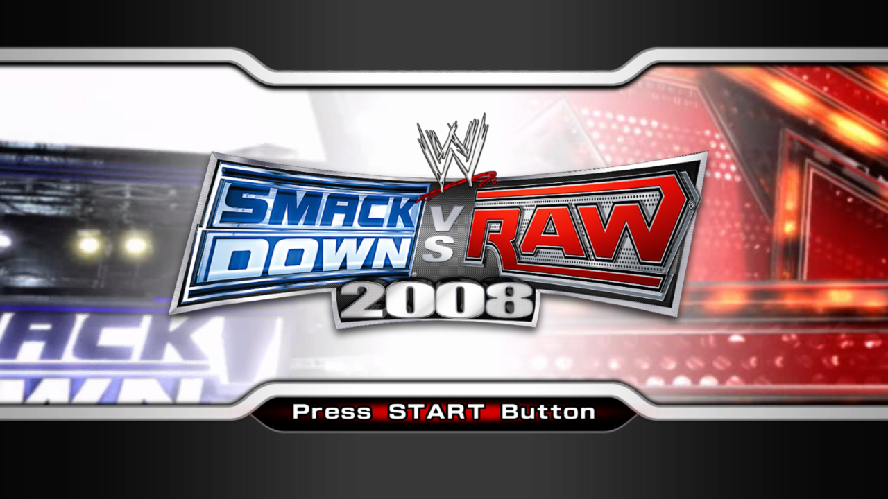
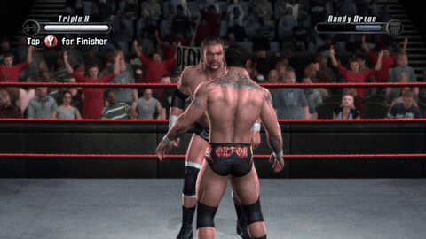

# SvR 2008 Recompiled

A native PC port of **WWE SmackDown vs. Raw 2008** (Xbox 360), built by statically recompiling the
game's PowerPC code into C++ and compiling it for x86-64. It is not an emulator: the game logic runs
as a native Windows executable, now at **native 60 FPS** everywhere, with modern PC features on the way.

> **Work in progress (version 0.1).** Nothing is released yet. This page tracks progress.

> [!IMPORTANT]
> **You must own the game to play this.** This project will never include or distribute the game's
> code, data or executables. To use it, you'll need your own legally purchased Xbox 360 copy of
> WWE SmackDown vs. Raw 2008, dumped from your own disc. **This project does not condone piracy.**
> Requests for game files, ISOs or download links will be closed without reply.

*Captured from the recompiled build running natively on Windows (Direct3D 12).*

## Showcase

## How it works

- The game executable (`default.xex`) is translated ahead of time into C++ with the
  [ReXGlue SDK](https://github.com/rexglue/rexglue-sdk) (the successor to XenonRecomp, the tool behind
  Unleashed Recompiled): about 29,000 functions, compiled with Clang.
- The parts of the Xbox 360 outside the game itself (kernel, GPU, XMA audio, file system) are handled by
  ReXGlue's runtime, which builds on the [Xenia](https://github.com/xenia-project/xenia) project's research.
  On Windows, the game's graphics are rendered through Vulkan (Direct3D 12 is also built in).
- Because the game code is ordinary C++ at build time, fixes and enhancements (like the frame-rate
  unlock) can be made directly in the code instead of through emulator patches.

## Progress

As of October 5, 2026:

- [x] Recompiles cleanly (0 analysis errors)
- [x] Boots, plays intro movies, reaches the title screen and menus
- [x] Matches playable at original speed on Windows, with no crashes, using the Vulkan renderer
- [x] Controllers: DualSense, Xbox and other SDL-supported pads, plus keyboard
- [x] Worked around a GPU crash 1–2 minutes into matches by switching from Direct3D 12 to Vulkan
      (the Direct3D 12 bug itself is still being investigated)
- [x] Windowed mode, plus a launcher with a live log window for crash reports
- [x] **Native 60 FPS** everywhere (menus, entrances, cutscenes and matches) at the correct game speed
- [x] On-screen FPS counter (F2 to toggle)
- [x] Higher internal resolution (1440p, 4K and above) with a startup resolution picker, plus 16x
      anisotropic filtering
- [ ] Full playthrough testing (career, season, create modes)
- [ ] Widescreen and ultrawide polish
- [ ] macOS (Apple Silicon): builds and renders, display output still being fixed
- [ ] Loose-file mod support, faster loading, clean removal of defunct Xbox Live features

## Development log

### October 5, 2026

- **Toolchain:** set up the Xbox 360 recompilation pipeline (ReXGlue SDK 0.10) on macOS (Apple Silicon)
  and Windows, including a disc extractor and build scripts.
- **Recompilation:** translated `default.xex` into C++. Analysis missed some functions that the game
  only reaches through pointers (vtables, callbacks), so a sweep now finds and adds them. That's
  about 29,000 functions with 0 analysis errors.
- **First boot:** the recompiled game renders the intro movies and the title screen correctly.
- **Windows build:** boots into menus and matches at the original speed, with DualSense and keyboard
  input and a windowed mode. A launcher shows the game's log live, so crashes can be diagnosed.
- **Matches crashed after 1–2 minutes:** under Direct3D 12 on an AMD Radeon RX 6650 XT, the GPU hit a
  memory fault. I added crash diagnostics (D3D12 breadcrumbs, page-fault reporting, debug-layer
  logging) and ruled out several causes. I also fixed a shader-compilation race found along the way.
- **Vulkan renderer:** matches now run without crashing on Vulkan. Windows uses it by default while
  the Direct3D 12 bug is investigated.
- **Sharper graphics:** the 3D can now render at 1440p, 4K or higher, picked from a startup window
  (Auto matches your monitor), with 16x anisotropic filtering.
- **Native 60 FPS:** two things were holding the game back.
  - The runtime paused for 1–10 ms whenever the game asked the Xbox music player for its status, which
    the game does every frame. That pause was meant for games that ask thousands of times a second, so
    it now only applies to them. Menus went from about 46 FPS to a locked 60.
  - The game switches itself into a 30 FPS mode for matches, entrances and cutscenes, and that mode
    also sets how far each frame moves the action. Showing those frames at 60 made entrances run at
    double speed, so the game is now kept in its own 60 FPS mode, where its timing is correct.
  The whole game now runs at 60 FPS at normal speed, shown by a new on-screen FPS counter.
- **Version 0.1.**
- **Heavy scenes:** entrance camera shots of the crowd draw each fan separately, up to about 5,000
  draw calls in one frame. The renderer now skips rebuilding texture bindings when a draw uses the
  same textures as the last one, and the graphics thread gets priority over other busy programs.
  No changes tuned to one PC: the build runs on the same range of CPUs and GPUs as before.
  Recording tip: use a recorder with hardware (GPU) encoding. Software (CPU) encoding competes with
  the game for the CPU and caused dips in crowd shots at 1440p.
- **Next:** HD textures, widescreen and ultrawide polish, and full playthrough testing.

## FAQ

**Can I download it?** Not yet. When there is a release, it will never include the game's code,
data or executables. You'll need your own legally purchased copy of the game, dumped from your own
disc.

**Can you share the game files or an ISO?** No. This project does not condone piracy and will never
host, share or link to game files. Issues or messages asking for them will be closed.

**Is this an emulator?** No. The game's code is translated to C++ before it runs, the same approach as
Unleashed Recompiled. Some Xbox 360 hardware behaviour (GPU, audio) is still reproduced by the runtime.

**Which version?** The Xbox 360 release, "WWE SmackDown vs. Raw 2008" (USA, Europe).

## Credits

- [ReXGlue SDK](https://github.com/rexglue/rexglue-sdk) for the recompiler and runtime
- [Xenia](https://github.com/xenia-project/xenia) for years of Xbox 360 research the runtime builds on
- Yuke's and THQ for the original game

## Legal

This is an unofficial fan project, not affiliated with or endorsed by WWE, THQ, Yuke's, 2K or Microsoft.
All trademarks belong to their owners. This repository contains no game code, assets or executables,
and it never will. Playing requires a legitimately owned copy of the original game. Piracy is not
supported or condoned.
